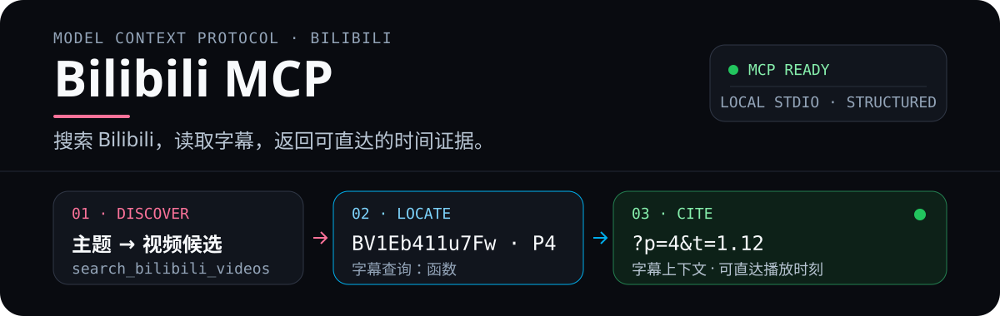

<p align="center">
  
</p>

# Bilibili MCP

<p align="center">
  <a href="https://www.npmjs.com/package/@xzxzzx/bilibili-mcp"></a>
  <a href="https://www.npmjs.com/package/@xzxzzx/bilibili-mcp"></a>
  <a href="https://www.gnu.org/licenses/gpl-3.0"></a>
</p>

<p align="center">
  让 Codex、Claude、Cursor 等 AI 客户端直接搜索 Bilibili 或读取当前账号收藏夹，并获取字幕、时间定位、元数据、章节与热门评论。
</p>

<p align="center">
  <a href="./README_EN.md">English</a> ·
  <a href="./docs/client-setup.md">全部 Agent / 客户端配置</a> ·
  <a href="./docs/tool-reference.md">工具参考</a> ·
  <a href="./CHANGELOG.md">更新日志</a> ·
  <a href="https://www.npmjs.com/package/@xzxzzx/bilibili-mcp">npm</a> ·
  <a href="https://github.com/XZXZZX-Ai/bilibili-mcp/releases/latest">最新 Release</a>
</p>

> [!NOTE]
> **真实验收链路：**搜索视频 → 选择 `BV1Eb411u7Fw` 的 P4 → 在字幕中搜索“函数” → 返回上下文与可直达的 [`?p=4&t=1.12`](https://www.bilibili.com/video/BV1Eb411u7Fw/?p=4&t=1.12) 证据链接。搜索与转录成功结果同时提供兼容文本和 MCP `structuredContent`。

## ⚡ 安装与配置

Agent 安装提示词、全部客户端配置位置、CLI / JSON / TOML 示例、Cookie 配置与登录验证步骤，都集中在：

### [打开完整 Agent / 客户端安装指南 →](./docs/client-setup.md)

> [!IMPORTANT]
> 本 README 不再重复任何安装或配置方法。请以安装指南为唯一完整来源。

安装完成后，可以直接向 AI 提问：

```text
搜索 Bilibili 上的 MCP 入门视频，选一个候选，
再从字幕中找出“工具调用”的出现位置并给我时间链接。
```

## 🧰 工具一览

| 目标 | 工具 | 返回重点 |
|---|---|---|
| 只有主题，还没有视频链接 | `search_bilibili_videos` | 最多 10 个普通视频候选及可继续调用的 BVID |
| 从我的 Bilibili 收藏夹开始读取 | `list_bilibili_favorite_videos` | 当前账号下所有创建的收藏夹的分页视频；按 `next_cursor` 翻页直到结束 |
| 获取纯字幕或定位关键词 | `get_video_transcript` | 转录文本、语言、时间戳、区间过滤、关键词上下文与证据链接 |
| 让 AI 总结视频 | `get_video_info` | 字幕优先；无字幕时可返回标题、简介和标签 |
| 查看结构化视频信息 | `get_video_metadata` | 标题、作者、时长、发布时间、标签、统计数据和多 P 列表 |
| 查看视频章节 | `get_video_chapters` | 创作者或平台定义的章节标题与起止时间 |
| 查看观众反馈 | `get_video_comments` | 热门评论、时间戳评论和可选回复 |
| 获取安全配置步骤 | `get_credential_setup_instructions` | 本机凭证配置命令与双语安全提醒 |
| 检查登录凭证 | `check_bilibili_credentials` | 配置来源、登录状态和下一步建议，不返回 Cookie |
| 检查 MCP 更新 | `check_mcp_update` | 当前版本、最新版本和安全更新命令 |

完整参数、JSON 示例、结构化错误和请求控制见[工具参考](./docs/tool-reference.md)。

### 关键能力

- **先发现、再阅读**：按主题搜索普通视频候选，或从当前账号的收藏夹分页发现视频，再把返回的 BVID 交给字幕、元数据、章节或评论工具。
- **可验证的字幕证据**：支持多 P、语言偏好、时间戳、时间区间和关键词上下文；命中项包含可直达播放时刻的 `timestamp_url`。
- **结构化输出**：视频搜索、视频转录和收藏夹分页的成功结果同时提供兼容文本与 MCP `structuredContent`。
- **明确的失败语义**：区分凭证失效、无字幕、访问受限、限流、超时和其他 API 错误，并给出下一步建议。
- **安全的凭证助手**：检查凭证状态时不返回 `SESSDATA`、`bili_jct`、`DedeUserID` 或完整 Cookie。

## 🧭 行为边界

- 视频搜索要求已配置且有效的 Bilibili 登录 Cookie，不提供匿名降级。
- 收藏夹发现要求已登录的当前账号身份，每次调用仅返回一个上游 20 条资源页；`next_cursor` 是无状态、版本化的不透明令牌，仅包含下一个 Folder 与页码，不会编码 Cookie、账号 ID、Folder 标题或视频数据。
- `get_video_transcript` 默认在无字幕时返回 `SUBTITLE_UNAVAILABLE`；只有显式设置 `fallback_to_description: true` 才会退回简介。
- 时间戳、区间过滤和关键词搜索不会静默退回简介，避免把描述误当作字幕证据。
- 章节来自 Bilibili 创作者或平台数据；没有章节时返回空列表，不推断章节。
- 本项目不会绕过付费、会员、地区、私密、下架或其他访问限制。
- 所有请求由用户本机发起；本项目是第三方工具，不是 Bilibili 官方服务。

## 🛠️ 开发

源码开发环境的安装步骤也集中在[完整安装指南：从源码开发](./docs/client-setup.md#从源码开发)。

| 命令 | 用途 |
|---|---|
| `npm run build` | 清理并编译 TypeScript 到 `dist/` |
| `npm test` | 运行 Vitest 测试 |
| `npm run watch` | 监听 TypeScript 变更 |
| `npm start` | 启动已构建的 stdio MCP server |
| `npm pack --dry-run` | 检查 npm 发布包内容 |

MCP stdio 协议使用 `stdout`；调试日志必须写到 `stderr`。测试和日志中不要使用真实 Cookie。

## ⚖️ 安全与许可

- 请遵守 Bilibili 用户协议、接口访问规则和当地法律法规，不要用于大规模抓取、商业剥削、绕过权限或其他滥用场景。
- 高频调用、异常访问模式或 Cookie 泄露可能触发限流、风控或账号异常，相关风险由使用者承担。
- 本项目仅向 Bilibili 官方接口发送 Bilibili 凭证，不会把 Cookie 上传到第三方服务；本地配置文件不承诺系统级加密。
- 本项目基于 [GNU General Public License v3.0](./LICENSE) 开源。

## 💬 反馈

遇到问题或有功能建议，请提交 [GitHub Issue](https://github.com/XZXZZX-Ai/bilibili-mcp/issues)；一般讨论可前往 [GitHub Discussions](https://github.com/XZXZZX-Ai/bilibili-mcp/discussions)。
