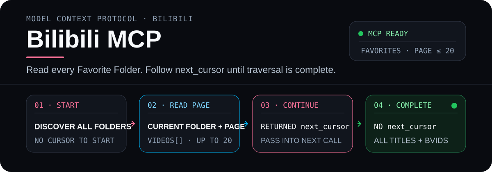

<p align="center">
  
</p>

# Bilibili MCP

<p align="center">
  <a href="https://www.npmjs.com/package/@xzxzzx/bilibili-mcp"></a>
  <a href="https://www.npmjs.com/package/@xzxzzx/bilibili-mcp"></a>
  <a href="https://www.gnu.org/licenses/gpl-3.0"></a>
</p>

<p align="center">
  Let Codex, Claude, Cursor, and other AI clients start from a Bilibili topic or the current account's Favorite Folders, then retrieve reusable BVIDs, transcript context, and evidence links that open at the exact playback time.
</p>

<p align="center">
  <a href="./README.md">简体中文</a> ·
  <a href="./docs/client-setup.en.md">All agent / client setups</a> ·
  <a href="./docs/tool-reference.en.md">Tool reference</a> ·
  <a href="./CHANGELOG_EN.md">Changelog</a> ·
  <a href="https://www.npmjs.com/package/@xzxzzx/bilibili-mcp">npm</a> ·
  <a href="https://github.com/XZXZZX-Ai/bilibili-mcp/releases/latest">Latest release</a>
</p>

## Two entrances, one evidence path

- **Start from my Favorites:** the first call needs no Folder ID. The Agent reads one upstream page of at most 20 rows, passes each returned `next_cursor` into the next call, and stops only when that field is absent.
- **Start from a topic:** receive up to 10 normal-video candidates without automatically fetching candidate transcripts or comments.
- **After obtaining a BVID:** retrieve its transcript, metadata, chapters, or popular comments. Keyword matches can include a direct `timestamp_url`.

> [!NOTE]
> **Verified workflow:** search → select Part 4 of `BV1Eb411u7Fw` → search its transcript for “函数” → receive bounded context and a direct [`?p=4&t=1.12`](https://www.bilibili.com/video/BV1Eb411u7Fw/?p=4&t=1.12) evidence link. Successful Video Search, Favorites-page, and transcript calls all provide compatible text plus MCP `structuredContent`.

## Let an Agent set it up

The copyable Agent prompt, every client configuration location, CLI / JSON / TOML examples, Cookie setup, and login verification live in one complete source:

### [Open the Agent / client installation guide →](./docs/client-setup.en.md)

After installation, test the complete Favorites traversal:

```text
Read every Favorite Folder created by my currently logged-in account.
Whenever a response contains next_cursor, keep calling with it until that field
is absent. Group the video titles and BVIDs by Folder; do not generate notes.
```

## Ten tools in three layers

### Discovery

`search_bilibili_videos` · `list_bilibili_favorite_videos`

Obtain BVIDs from a topic or every created Favorite Folder on the current account.

### Content evidence

`get_video_transcript` · `get_video_info` · `get_video_metadata` · `get_video_chapters` · `get_video_comments`

Retrieve transcripts, timestamps, Video information, chapters, and viewer feedback.

### Local helpers

`get_credential_setup_instructions` · `check_bilibili_credentials` · `check_mcp_update`

Configure credentials safely, verify login, and check the package version.

See the [tool reference](./docs/tool-reference.en.md) for complete parameters, JSON examples, structured errors, and request controls.

## Design priorities

- **Bilibili-native:** preserve multi-Part Videos, platform Chapters, popular comments, and Favorite Membership instead of becoming a generic downloader.
- **Evidence-first:** select a language, add timestamps, filter a time range, or search bounded transcript context; matches can open at the exact playback time.
- **On demand:** Favorites discovery returns Folder context and Video rows only. It does not generate notes or prefetch transcripts, comments, or Chapters.
- **Credentials stay local:** status tools never return `SESSDATA`, `bili_jct`, `DedeUserID`, or a complete Cookie.

## Behavior boundaries

- “Every Favorite Folder” means Folders created by the currently logged-in account and currently visible through the Bilibili API. Traversal is live best effort, not a snapshot.
- Each Favorites call reads at most one upstream 20-row page. The Agent must keep following `next_cursor`; removed or unsafe-to-normalize rows are counted in `skipped_count`.
- Video Search and Favorites discovery require valid logged-in credentials and do not fall back to anonymous requests.
- `get_video_transcript` returns `SUBTITLE_UNAVAILABLE` by default when no subtitle exists. Description fallback requires explicit `fallback_to_description: true`; timed output and keyword search never silently use a description.
- Chapters come only from Bilibili creator/platform data. The project does not bypass paid, member-only, regional, private, removed, or other access restrictions.
- Requests originate on the user's machine. This is a third-party project, not an official Bilibili service.

## Development

Source-development setup is also centralized in the [complete installation guide: develop from source](./docs/client-setup.en.md#develop-from-source).

| Command | Purpose |
|---|---|
| `npm run build` | Clean and compile TypeScript into `dist/` |
| `npm test` | Run the Vitest suite |
| `npm run watch` | Watch TypeScript sources |
| `npm start` | Start the built stdio MCP server |
| `npm pack --dry-run` | Inspect npm package contents |

MCP stdio protocol data uses `stdout`; diagnostics must go to `stderr`. Never use real Cookie values in tests or logs.

## Safety and license

- Follow Bilibili's terms, interface-access rules, and applicable law. Do not use this project for bulk scraping, commercial exploitation, permission bypass, or other abuse.
- High request volume, unusual access patterns, or leaked Cookies may trigger throttling, risk controls, or account issues. Users accept those risks.
- The project sends Bilibili credentials only to official Bilibili interfaces and does not upload Cookies to third-party services. Local credential files do not promise operating-system-level encryption.
- This project is licensed under the [GNU General Public License v3.0](./LICENSE).

## Feedback

For bugs and feature requests, open a [GitHub Issue](https://github.com/XZXZZX-Ai/bilibili-mcp/issues). Use [GitHub Discussions](https://github.com/XZXZZX-Ai/bilibili-mcp/discussions) for general questions.
